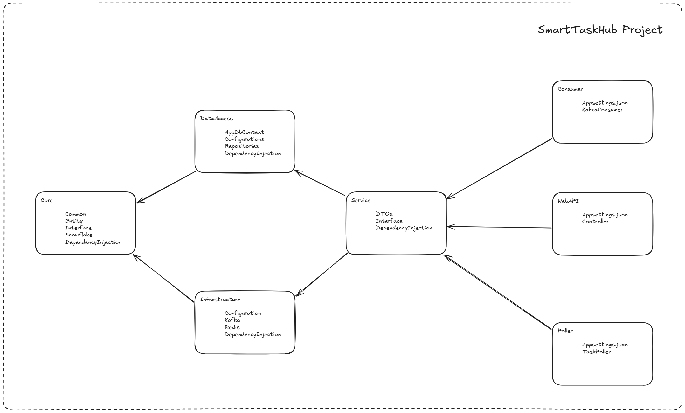

Translations: [English](README.md) | [简体中文](README_cn.md)

# Smart Task Hub

SmartTaskHub is an smart task management system that provides mechanisms for task registration, task discovery, and task processing!

## Requirements

- Enterprise WeChat Push Interface
- MES has equipment repair work orders, maintenance work orders, security light messages, quality inspection tasks and other data, design a timeout reminder, and in the case of reminding a certain period of time after the escalation of the message pushed the function; 
  - Requirements of a variety of tasks to use a unified trigger method;
  - For tasks that have generated a timeout reminder message will not repeat the detection and ge
  - Other tasks can be extended into the message detection and reminder mechanism (extending the WMS outbound task to the unified reminder function);

Summary: a unified trigger, no longer repeat the detection and generation, scalable

## After the requirements are realized

- **Harmonize the functionality for retrieving**overdue tasks;
- **Harmonize the function of handling**overdue tasks;
- Third-party systems can register and unregister tasks through the registration task interface


## Framework design

### Framework


### Module dependency diagram

```
SmartTaskHub
    SmartTaskHub.Core               Core layer, core business model and interfaces
    SmartTaskHub.DataAccess         Data access layer, database access and data persistence
    SmartTaskHub.Infrastructure     Infrastructure layer, Redis, Kafka
    SmartTaskHub.Service            Business logic layer, business logic implementation, integration of various layers to complete the core business
    SmartTaskHub.API                API interface layer, providing services for the front-end or client-side
    SmartTaskHub.Poller             Polling service, Redis queue polling
    SmartTaskHub.Consumer           Consumer service, listening to the message queue and asynchronous processing
```



## Functional design

### Equipment maintenance orders

Table fields:

```
long Id
string Code
bool IsCompleted
long PlannedCompletionTime
long CreatedAt
long UpdatedAt
```

Function: Add, Modify, Delete, Done

### Task timeout rules

Table fields:

```
long Id
string TaskType
TimeSpan TimeoutDuration
long CreatedAt
long UpdatedAt
```

Function: Add, Delete

## O&M

### Entity Mapping

Go to the SmartTaskHub.API directory and execute the

```shell
dotnet ef migrations add InitialCreate --project ../SmartTaskHub.DataAccess --startup-project .

dotnet ef database update --project ../SmartTaskHub.DataAccess --startup-project .
```

### Docker containers

mysql

```shell
docker run -d \
  --name mysql \
  -e MYSQL_ROOT_PASSWORD=123456 \
  -p 3306:3306 \
  -v /data/docker/mysql:/var/lib/mysql \
  mysql/mysql-server:8.0.28
```

redis

```shell
docker run -d \
  --name redis \
  -p 6379:6379 \
  -e TZ=Asia/Shanghai \
  -e REDIS_VERSION=6.2.5 \
  -v /data/docker/redis/data:/data \
  --restart always \
  redis:6.2.5 \
  redis-server \
  --requirepass 123456 \
  --appendonly yes
```

zookeeper

```shell
docker run -d \
  --name zookeeper \
  -p 12181:2181 \
  -e TZ=Asia/Shanghai \
  -v data/docker/zookeeper:/data \
  --restart always \
  wurstmeister/zookeeper:latest
```

kafka

```shell
docker run -d \
  --name kafka \
  -p 9092:9092 \
  -e KAFKA_ADVERTISED_LISTENERS=INSIDE://ip:9092,OUTSIDE://ip:9092 \
  -e KAFKA_LISTENER_SECURITY_PROTOCOL_MAP=INSIDE:PLAINTEXT,OUTSIDE:PLAINTEXT \
  -e KAFKA_LISTENERS=INSIDE://0.0.0.0:9092,OUTSIDE://0.0.0.0:9092 \
  -e KAFKA_INTER_BROKER_LISTENER_NAME=INSIDE \
  -e KAFKA_ZOOKEEPER_CONNECT=ip:2181 \
  -e KAFKA_CREATE_TOPICS="pending-tasks:1:1" \
  -e KAFKA_LOG_DIRS=/kafka/logs \
  -e TZ=Asia/Shanghai \
  -v /data/docker/kafka:/kafka/logs \
  --restart always \
  --link zookeeper:zookeeper \
  wurstmeister/kafka:latest
```