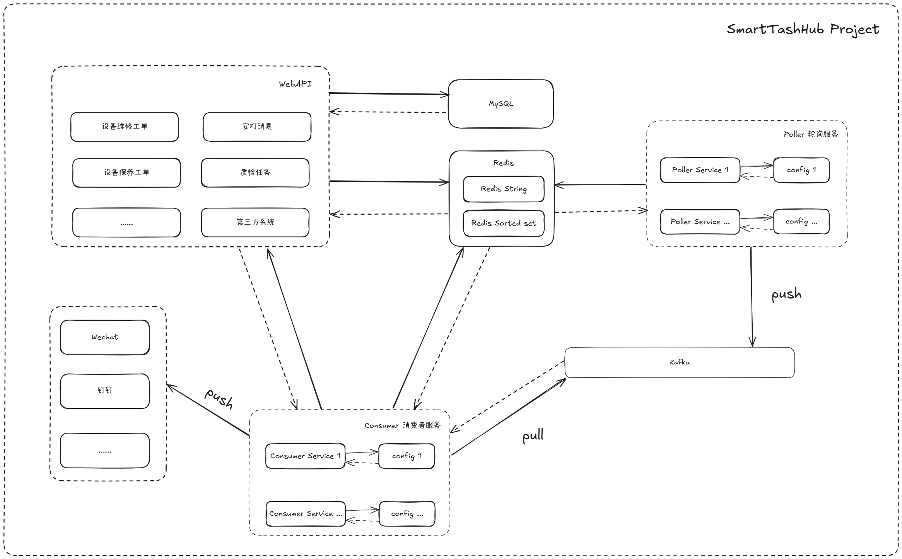
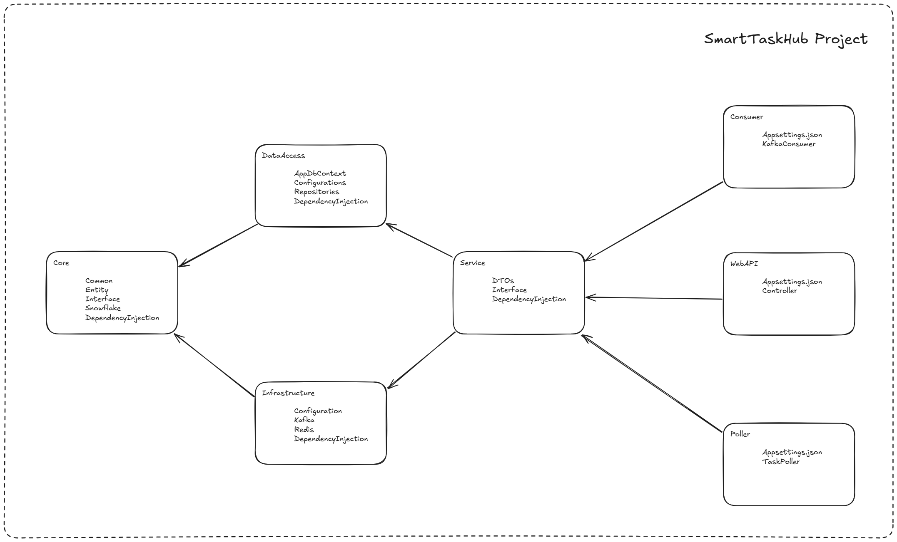

# Smart Task Hub

SmartTaskHub 是一个智能任务管理系统，提供任务注册、任务发现和任务处理机制！

## 需求

- 企业微信推送接口
- MES中有 设备维修工单 、保养工单、安灯消息、质检任务等数据 ，设计一个超时提醒，并在提醒后一定时间内未处理的情况下升级消息推送的功能；
  - 要求各种任务使用统一的触发方式；
  - 对于产生过超时提醒消息的任务不再重复检测生成；
  - 可扩展其他任务进入到消息检测、提醒机制中（扩展WMS出库任务到统一提醒功能中）；

摘要：统一的触发方式, 不再重复检测生成，扩展性强

## 需求实现后

- 统一**检索**超期任务的功能；
- 统一**处理**超期任务的功能；
- 第三方系统可以通过注册任务接口，进行注册、取消注册任务

## 框架设计

### 框架



### 模块依赖关系图

```
SmartTaskHub
    SmartTaskHub.Core               Core 层，核心业务模型和接口
    SmartTaskHub.DataAccess         数据访问层，数据库访问和数据持久化
    SmartTaskHub.Infrastructure     基础设施层, Redis, Kafka
    SmartTaskHub.Service            业务逻辑层，业务逻辑实现，整合各层完成核心业务
    SmartTaskHub.API                API 接口层，为前端或客户端提供服务
    SmartTaskHub.Poller             轮询服务，Redis 队列的轮询
    SmartTaskHub.Consumer           消费者服务，监听消息队列并异步处理
```




## 功能设计

### 设备维修工单

表字段：

```
long Id
string Code
bool IsCompleted
long PlannedCompletionTime
long CreatedAt
long UpdatedAt
```
功能： 添加、修改、删除、完成

### 任务超时规则

表字段：

```
long Id
string TaskType
TimeSpan TimeoutDuration
long CreatedAt
long UpdatedAt
```

功能： 添加、删除


## 运维

### 实体映射

进入 SmartTaskHub.API 目录下执行

```
dotnet ef migrations add InitialCreate --project ../SmartTaskHub.DataAccess --startup-project .

dotnet ef database update --project ../SmartTaskHub.DataAccess --startup-project .
```


### Docker 容器

mysql

```shell
docker run -d \
  --name mysql \
  -e MYSQL_ROOT_PASSWORD=123456 \
  -p 3306:3306 \
  -v /data/docker/mysql:/var/lib/mysql \
  mysql/mysql-server:8.0.28
```

redis

```shell
docker run -d \
  --name redis \
  -p 6379:6379 \
  -e TZ=Asia/Shanghai \
  -e REDIS_VERSION=6.2.5 \
  -v /data/docker/redis/data:/data \
  --restart always \
  redis:6.2.5 \
  redis-server \
  --requirepass 123456 \
  --appendonly yes
```

zookeeper

```shell
docker run -d \
  --name zookeeper \
  -p 12181:2181 \
  -e TZ=Asia/Shanghai \
  -v data/docker/zookeeper:/data \
  --restart always \
  wurstmeister/zookeeper:latest
```

kafka

```shell
docker run -d \
  --name kafka \
  -p 9092:9092 \
  -e KAFKA_ADVERTISED_LISTENERS=INSIDE://ip:9092,OUTSIDE://ip:9092 \
  -e KAFKA_LISTENER_SECURITY_PROTOCOL_MAP=INSIDE:PLAINTEXT,OUTSIDE:PLAINTEXT \
  -e KAFKA_LISTENERS=INSIDE://0.0.0.0:9092,OUTSIDE://0.0.0.0:9092 \
  -e KAFKA_INTER_BROKER_LISTENER_NAME=INSIDE \
  -e KAFKA_ZOOKEEPER_CONNECT=ip:2181 \
  -e KAFKA_CREATE_TOPICS="pending-tasks:1:1" \
  -e KAFKA_LOG_DIRS=/kafka/logs \
  -e TZ=Asia/Shanghai \
  -v /data/docker/kafka:/kafka/logs \
  --restart always \
  --link zookeeper:zookeeper \
  wurstmeister/kafka:latest
```